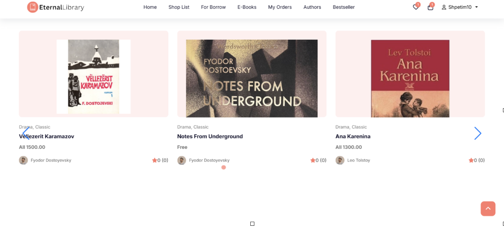
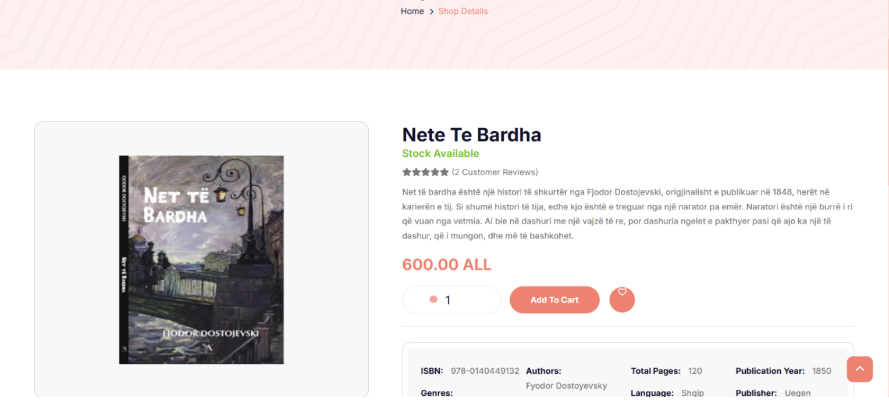
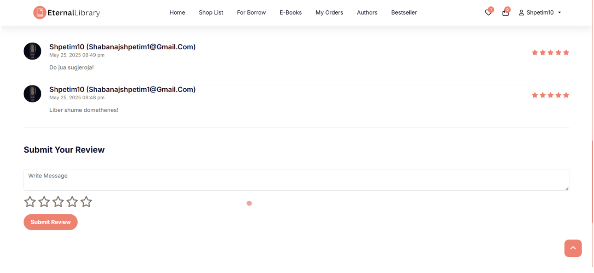
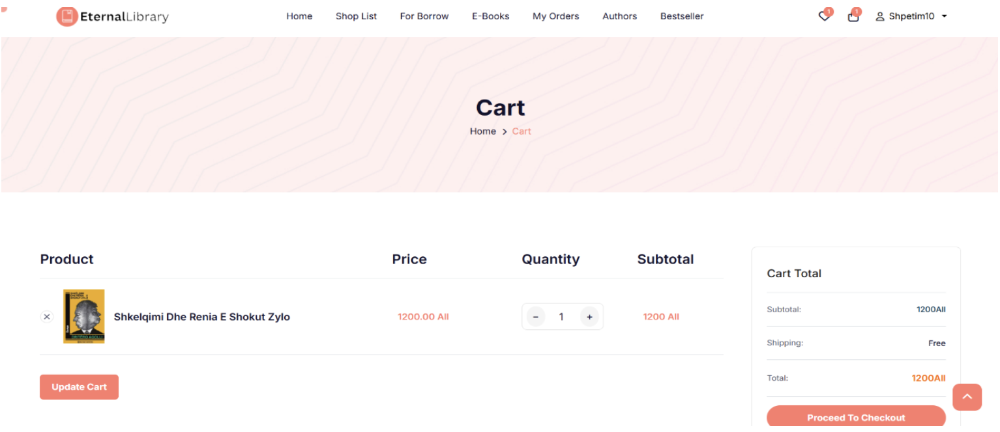
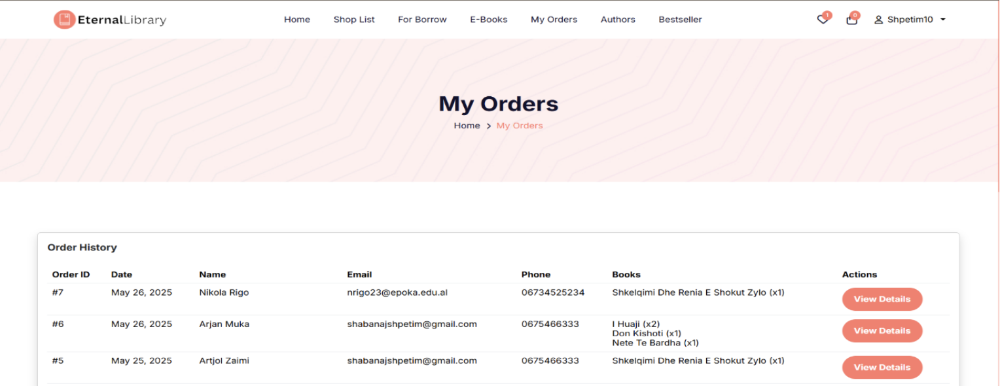
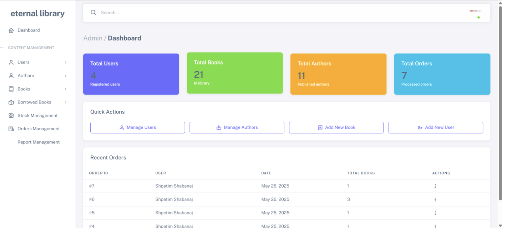

# 📚 EternalLibrary – Online Library Management System

EternalLibrary is a full-featured web-based Library Management System designed to simplify the management of books, authors, and user interactions within a digital library environment.

The platform provides a seamless experience for both users and administrators by combining book discovery, online purchasing, borrowing functionality, review systems, and a dedicated administrative dashboard for content and order management.

The system demonstrates modern web development practices through structured architecture, database integration, and user-centered interface design.

---

# 🌐 System Overview

The platform allows users to:

• Browse a digital catalog of books  
• Filter books by categories and genres  
• Purchase books directly through the platform  
• Borrow books from the library collection  
• Read and download available e-books  
• Write and view book reviews  
• Track their order history  

Administrators have access to a dedicated dashboard that allows management of:

• Users  
• Authors  
• Books  
• Borrowed books  
• Orders and stock  

The goal of the platform is to simulate a real-world digital library and bookstore environment.

---

# 🚀 Key Features

### 📖 Book Catalog
Users can browse a large collection of books with filtering options by genre and category.

### 🛒 Shopping Cart & Orders
The platform includes a complete ordering workflow with cart management and order history tracking.

### ⭐ Review & Rating System
Users can submit reviews and ratings for books, allowing community feedback and quality ranking.

### 📚 E-Book Access
Digital books can be browsed and accessed directly from the platform.

### 📦 Borrowing System
Books can be borrowed from the library catalog, simulating real library functionality.

### 👤 User Accounts
Registered users can manage their orders, reviews, and interactions with the platform.

### ⚙️ Admin Dashboard
Administrators can manage the entire platform through an intuitive dashboard, including:

• user management  
• author management  
• book management  
• order monitoring  
• library statistics  

---

# 🖥️ Screenshots

## Homepage

---

## Book Catalog

---

## Book Details Page

---

## Review System

---

## Shopping Cart

---

## Order History

---

## Admin Dashboard

---

# 🧩 System Architecture

The system follows a structured architecture separating client-side and server-side responsibilities.

### Frontend
Responsible for rendering the user interface and handling user interactions.

### Backend
Processes application logic, handles authentication, manages database operations, and coordinates platform functionality.

### Database
Stores all platform data including books, authors, users, reviews, and orders.

---

# 🛠️ Technologies Used

### Frontend
• HTML  
• CSS  
• SCSS  
• JavaScript  

### Backend
• PHP  

### Database
• MySQL  

---

# 📈 System Capabilities

The platform demonstrates multiple key aspects of modern web application development:

• full CRUD operations  
• database integration  
• authentication systems  
• order management  
• review and rating systems  
• responsive user interface  
• administrative dashboards  

---

# 👥 Team Members

This project was developed collaboratively by the following team members:

• Shpetim Shabanaj  
• Artjol Zaimi  
• Arjan Muka  
• Eglis Braho  
• Nikola Rigo  
• Elkier Ago  
• Mirsad Amuli  

---

# 📜 License

This project was developed for educational purposes as part of the **CEN311 – Web Technologies & Programming** course.
